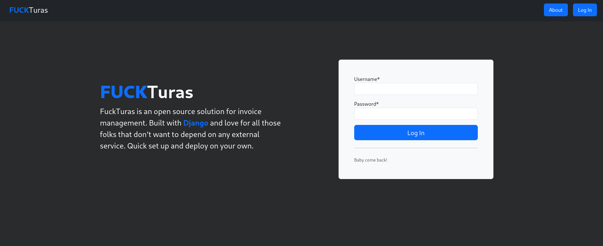
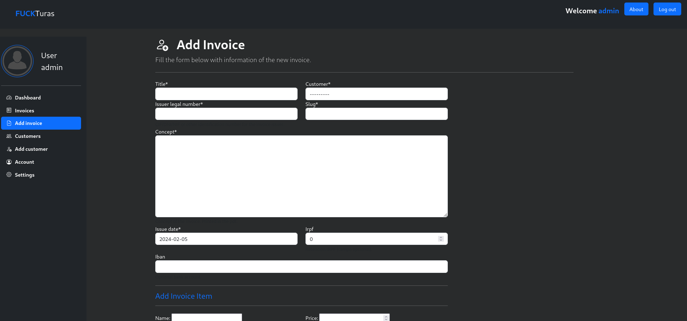
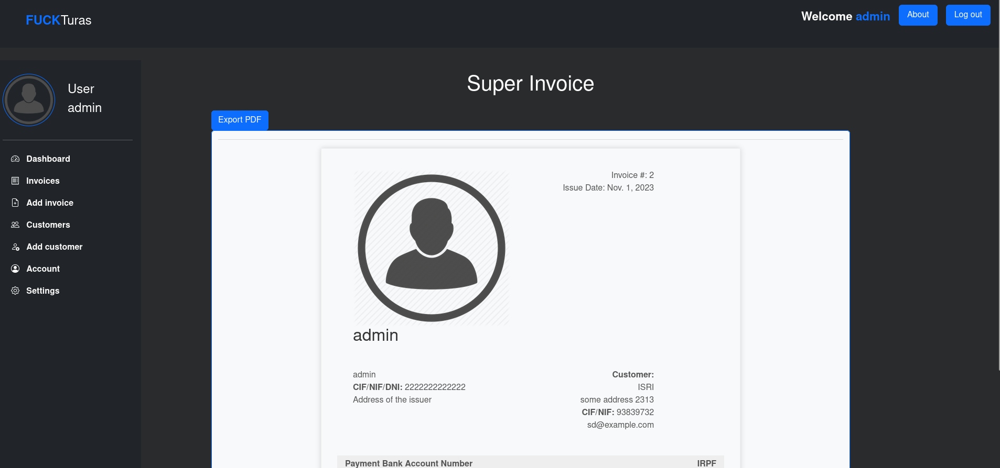

# FuckTuras
Are you tired of fighting with those grumpy old billing programs that ask for your piggy bank's life savings? Us too! That's why we created <strong>FuckTuras</strong>, the magical place where managing your invoices is as easy as counting jellybeans and, guess what, it's absolutely free and open source!

What Makes <strong>FuckTuras</strong> Extra Special?

Absolutely nothing! Still want to give it a try?

## Status
Building...

## Todo

A lot.

## Why this shitty name?
Well, it is supposed to be a word game. Invoice in Spanish is written as "factura", which is pronounced the same as "fuck" + "tura".

## License

  THE BEER-WARE LICENSE" (Revision 42):
  <phk@FreeBSD.ORG> wrote this file.  As long as you retain this notice you
  can do whatever you want with this stuff. If we meet some day, and you think
  this stuff is worth it, you can buy me a beer in return.   0xrauros
 
